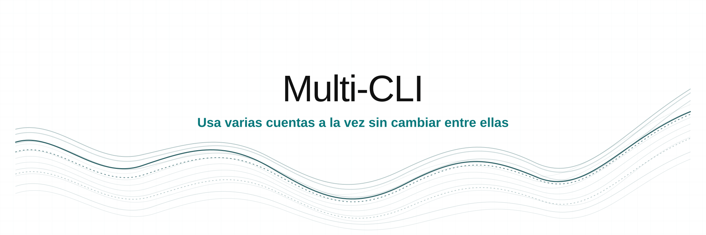

<p align="center">
  
</p>

<p align="center">Usa varias cuentas a la vez sin cambiar entre ellas.</p>

<p align="center">
  <a href="#supported-ai-tools"></a>
  <a href="../../release/VERSION"></a>
  <a href="#install"></a>
  <a href="../../LICENSE"></a>
</p>

<p align="center">
  <a href="../../README.md">English</a> |
  <a href="es.md"><b>Español</b></a> |
  <a href="ar.md">العربية</a> |
  <a href="zh.md">中文</a> |
  <a href="ru.md">Русский</a> |
  <a href="he.md">עברית</a>
</p>

## Contenido

[Instalación](#install) · [Inicio rápido](#quick-start) · [Herramientas de IA](#supported-ai-tools) · [Comandos](#commands) · [Aislamiento](#how-isolation-works) · [Mover sesiones](#move-sessions-between-accounts) · [Solución de problemas](#troubleshooting) · [Desinstalación](#uninstall)

<a id="install"></a>

## Instalación

### Requisitos

- macOS o Linux: [Bash 3.2 o posterior](https://www.gnu.org/software/bash/)
- Windows: [Windows PowerShell 5.1](https://www.microsoft.com/download/details.aspx?id=54616)
- [jq 1.7.1](https://jqlang.github.io/jq/download/), se instala automáticamente si no está disponible
- Una de las [herramientas de IA compatibles](#supported-ai-tools)

### Instalar desde el código fuente

Este método requiere [Git](https://git-scm.com/downloads).

```bash
git clone https://github.com/LuchoNoPrograma/nini-agents.git
cd nini-agents
./install/install.sh --local
```

Windows PowerShell:

```powershell
git clone https://github.com/LuchoNoPrograma/nini-agents.git
cd nini-agents
.\install\install.ps1 -Local
```

<a id="quick-start"></a>

## Inicio rápido

```bash
nini-agents doctor
nini-agents new claude-cli/work
nini-agents claude-cli/work
```

<a id="supported-ai-tools"></a>

## Herramientas de IA compatibles

| Herramienta de IA | ID | Plataformas | Límite de la cuenta |
|---|---|---|---|
| [AGY CLI](../adapters/agy-cli.md) | `agy-cli` | Windows | Usuario del sistema operativo |
| [Antigravity](../adapters/antigravity.md) | `antigravity` | Windows | Usuario del sistema operativo |
| [Claude Code](../adapters/claude-cli.md) | `claude-cli` | Windows, Linux, claves API en macOS | Superposición de archivos |
| [Codex CLI](../adapters/codex.md) | `codex` | Windows, macOS, Linux | Superposición de archivos |
| [Codex Desktop](../adapters/codex-gui.md) | `codex-gui` | Windows | Usuario del sistema operativo |
| [Command Code](../adapters/commandcode.md) | `commandcode` | Windows, macOS, Linux | Superposición de archivos |
| [GitHub Copilot CLI](../adapters/copilot-cli.md) | `copilot-cli` | Windows, macOS, Linux | Secreto de proceso |
| [GitHub Copilot en VS Code](../adapters/copilot-vscode.md) | `copilot-vscode` | Windows | Usuario del sistema operativo |
| [Cursor CLI](../adapters/cursor-cli.md) | `cursor-cli` | Windows, macOS, Linux | Secreto de proceso |
| [Cursor Desktop](../adapters/cursor.md) | `cursor` | Windows, macOS, Linux | Directorio aislado de la herramienta |
| [Gemini CLI](../adapters/gemini-cli.md) | `gemini-cli` | Windows, macOS, Linux | Superposición de archivos |
| [Grok Build CLI](../adapters/grok-cli.md) | `grok-cli` | Windows, macOS, Linux | Secreto de proceso |
| [Kimi Code CLI](../adapters/kimi-cli.md) | `kimi-cli` | Windows, macOS, Linux | Secreto de proceso |
| [Kiro](../adapters/kiro.md) | `kiro` | Windows, macOS, Linux | Usuario del sistema operativo |
| [OpenCode](../adapters/opencode.md) | `opencode` | Windows, macOS, Linux | Directorio aislado de la herramienta |
| [Windsurf](../adapters/windsurf.md) | `windsurf` | Windows, macOS, Linux | Usuario del sistema operativo |
| [Zed](../adapters/zed.md) | `zed` | Windows | Usuario del sistema operativo |

Consulta los límites de cada plataforma en la [matriz de compatibilidad](../support-matrix.md). Ejecuta `nini-agents tools` para comprobar tu equipo.

<a id="commands"></a>

## Comandos

### Perfiles

| Comando | Acción |
|---|---|
| `nini-agents new <tool>/<name>` | Crear un perfil de cuenta con credenciales separadas y estado normal compartido |
| `nini-agents new <tool>/<name> --isolated` | Crear un perfil con todo el directorio aislado si la herramienta de IA lo admite; alias: `--isolate`, `-i` |
| `nini-agents new <tool>/<name> --from <template>` | Crear un perfil con esquema v2 desde una plantilla con esquema v2 |
| `nini-agents <tool>/<name>` | Iniciar un perfil |
| `nini-agents launch <tool>/<name> [-- args...]` | Iniciar y pasar argumentos a la herramienta |
| `nini-agents list [<tool>]` | Enumerar perfiles |
| `nini-agents clone <tool>/<src> <tool>/<dest>` | Copiar un perfil con esquema v2 |
| `nini-agents rename <tool>/<old> <tool>/<new>` | Cambiar el nombre de un perfil |
| `nini-agents delete <tool>/<name>` | Eliminar un perfil tras confirmar |

### Credenciales y portabilidad

| Comando | Acción |
|---|---|
| `nini-agents auth set <tool>/<profile>` | Guardar un secreto de proceso en el almacén de credenciales del sistema |
| `nini-agents auth status <tool>/<profile>` | Comprobar si existe el secreto |
| `nini-agents auth clear <tool>/<profile>` | Eliminar el secreto |
| `nini-agents permissions show \| set <read-only\|workspace\|full-access>` | Mostrar o guardar los permisos compartidos de Codex para sesiones nuevas |
| `nini-agents continue <tool> <src> <dest> [--dry-run] [--no-merge]` | Copiar el estado de sesión compatible, nunca las credenciales |
| `nini-agents template save <tool>/<profile> <name>` | Guardar una plantilla con esquema v2 sin credenciales |
| `nini-agents template list \| delete <name>` | Enumerar o eliminar plantillas |
| `nini-agents export <tool>/<name> [path]` | Exportar un perfil con esquema v2 |
| `nini-agents import <archive> <tool>/<name>` | Importar un archivo con esquema v2 |

### Mantenimiento

| Comando | Acción |
|---|---|
| `nini-agents migrate <tool>/<name> [--dry-run] [--prefer-profile] [--preserve-unknown]` | Migrar un perfil antiguo al esquema v2 |
| `nini-agents status` | Mostrar perfiles y tamaños |
| `nini-agents stats` | Mostrar el uso de almacenamiento de los perfiles |
| `nini-agents doctor [--deep]` | Diagnosticar el entorno y, opcionalmente, auditar los entornos de ejecución |
| `nini-agents completion {bash\|zsh\|powershell}` | Mostrar la configuración de autocompletado del shell |
| `nini-agents help` | Mostrar todos los comandos |
| `nini-agents version` | Mostrar la versión instalada |

<a id="how-isolation-works"></a>

## Cómo funciona el aislamiento

| Modo | Qué queda separado | Qué queda compartido |
|---|---|---|
| Superposición de archivos | Archivos de credenciales declarados | Configuración y conversaciones nativas |
| Secreto de proceso | Una credencial inyectada en el proceso secundario | El estado normal de la herramienta |
| Usuario del sistema operativo | La identidad de credenciales fija del producto | Nada, salvo que la herramienta de IA lo permita |
| Directorio aislado de la herramienta | Todo el directorio de la herramienta | Nada |

Los perfiles usan el límite compatible más estrecho. `--isolated` crea un directorio de herramienta separado. Las credenciales fijas del sistema usan un usuario del sistema administrado por Nini Agents y requieren una terminal con privilegios elevados en Windows.

Las herramientas de IA que usan un secreto de proceso requieren un paso adicional antes de iniciarlas:

```bash
nini-agents new cursor-cli/work
nini-agents auth set cursor-cli/work
nini-agents cursor-cli/work
```

Los perfiles antiguos conservan su aislamiento original de todo el directorio. Previsualiza la migración con:

```bash
nini-agents migrate codex/work --dry-run
```

Solo los perfiles, plantillas y archivos con esquema v2 son portables. Migra primero los perfiles antiguos.

<a id="move-sessions-between-accounts"></a>

## Mover sesiones entre cuentas

Copia el estado compatible de una conversación cuando una cuenta llegue a su límite:

```bash
nini-agents continue codex work personal --dry-run
nini-agents continue codex work personal
nini-agents codex/personal
codex resume
```

`base` representa el directorio normal de la herramienta, por lo que cualquiera de los extremos puede ser un perfil o la instalación predeterminada. Las credenciales nunca se copian. La transferencia de sesiones es compatible con `codex`, `claude-cli`, `gemini-cli` y `commandcode`.

## Alias del shell

Cada perfil recibe un atajo como `claude-cli-work`.

| Plataforma | Ubicación |
|---|---|
| macOS y Linux | `~/MultiCliProfiles/bin/` |
| Windows | `~/MultiCliProfiles/bin/`, además de accesos directos del menú Inicio para perfiles gráficos |

## Configuración

| Variable | Valor predeterminado | Función |
|---|---|---|
| `MULTICLI_HOME` | `~/MultiCliProfiles` | Almacenamiento de perfiles |
| `MULTICLI_OVERRIDE_BINARY` | sin definir | Sustituir la detección del ejecutable para un inicio |
| `NINI_AGENTS_REPO` | repositorio de GitHub | Cambiar el origen de instalación |
| `NINI_AGENTS_INSTALL_DIR` | valor predeterminado de la plataforma | Cambiar el directorio de instalación |

`MULTICLI_REPO` y `MULTICLI_INSTALL_DIR` permanecen como aliases temporales.
El comando `multi-cli` también permanece como shim del motor `nini-agents`.

<a id="troubleshooting"></a>

## Solución de problemas

```bash
nini-agents doctor
nini-agents doctor --deep
nini-agents tools
```

Reinicia la terminal si no encuentra `nini-agents` o el alias de un perfil nuevo después de instalar. La [matriz de compatibilidad](../support-matrix.md) incluye los requisitos específicos de cada producto.

<a id="uninstall"></a>

## Desinstalación

macOS y Linux:

```bash
curl -fsSL https://raw.githubusercontent.com/LuchoNoPrograma/nini-agents/main/install/uninstall.sh | bash
```

Windows PowerShell:

```powershell
irm https://raw.githubusercontent.com/LuchoNoPrograma/nini-agents/main/install/uninstall.ps1 | iex
```

Los datos de los perfiles se conservan salvo que confirmes su eliminación.

## Enlaces

- [Matriz de compatibilidad](../support-matrix.md)
- [Política de seguridad](../SECURITY.md)
- [Contribuir](../CONTRIBUTING.md)
- [Soporte](../SUPPORT.md)

## Licencia

[MIT](../../LICENSE)
