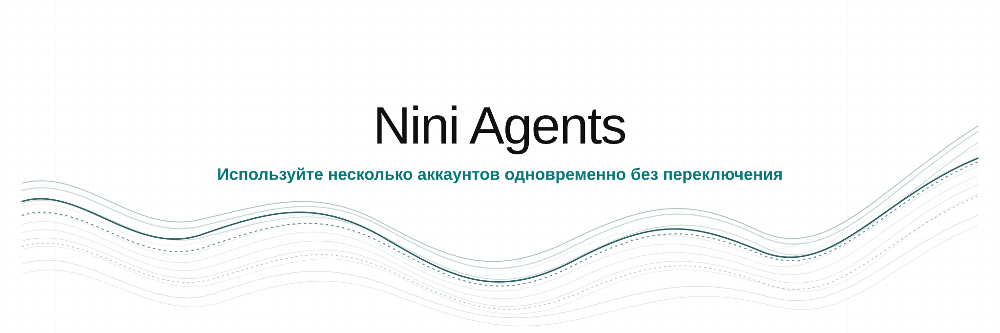

<p align="center">
  
</p>

<p align="center">Используйте несколько аккаунтов одновременно без переключения.</p>

<p align="center">
  <a href="#supported-ai-tools"></a>
  <a href="../../release/VERSION"></a>
  <a href="#install"></a>
  <a href="../../LICENSE"></a>
</p>

<p align="center">
  <a href="../../README.md">English</a> |
  <a href="es.md">Español</a> |
  <a href="ar.md">العربية</a> |
  <a href="zh.md">中文</a> |
  <a href="ru.md"><b>Русский</b></a> |
  <a href="he.md">עברית</a>
</p>

## Содержание

[Установка](#install) · [Быстрый старт](#quick-start) · [AI-инструменты](#supported-ai-tools) · [Команды](#commands) · [Изоляция](#how-isolation-works) · [Перенос сессий](#move-sessions-between-accounts) · [Устранение неполадок](#troubleshooting) · [Удаление](#uninstall)

<a id="install"></a>

## Установка

### Требования

- macOS или Linux: [Bash 3.2 или новее](https://www.gnu.org/software/bash/)
- Windows: [Windows PowerShell 5.1](https://www.microsoft.com/download/details.aspx?id=54616)
- [jq 1.7.1](https://jqlang.github.io/jq/download/), устанавливается автоматически при отсутствии
- Один из [поддерживаемых AI-инструментов](#supported-ai-tools)

### Установка из исходного кода

Для этого способа требуется [Git](https://git-scm.com/downloads).

```bash
git clone https://github.com/LuchoNoPrograma/nini-agents.git
cd nini-agents
./install/install.sh --local
```

Windows PowerShell:

```powershell
git clone https://github.com/LuchoNoPrograma/nini-agents.git
cd nini-agents
.\install\install.ps1 -Local
```

<a id="quick-start"></a>

## Быстрый старт

```bash
nini-agents doctor
nini-agents new claude-cli/work
nini-agents claude-cli/work
```

<a id="supported-ai-tools"></a>

## Поддерживаемые AI-инструменты

| AI-инструмент | ID | Платформы | Граница аккаунта |
|---|---|---|---|
| [AGY CLI](../adapters/agy-cli.md) | `agy-cli` | Windows | Пользователь ОС |
| [Antigravity](../adapters/antigravity.md) | `antigravity` | Windows | Пользователь ОС |
| [Claude Code](../adapters/claude-cli.md) | `claude-cli` | Windows, Linux, ключи API в macOS | Наложение файлов |
| [Codex CLI](../adapters/codex.md) | `codex` | Windows, macOS, Linux | Наложение файлов |
| [Codex Desktop](../adapters/codex-gui.md) | `codex-gui` | Windows | Пользователь ОС |
| [Command Code](../adapters/commandcode.md) | `commandcode` | Windows, macOS, Linux | Наложение файлов |
| [GitHub Copilot CLI](../adapters/copilot-cli.md) | `copilot-cli` | Windows, macOS, Linux | Секрет процесса |
| [GitHub Copilot в VS Code](../adapters/copilot-vscode.md) | `copilot-vscode` | Windows | Пользователь ОС |
| [Cursor CLI](../adapters/cursor-cli.md) | `cursor-cli` | Windows, macOS, Linux | Секрет процесса |
| [Cursor Desktop](../adapters/cursor.md) | `cursor` | Windows, macOS, Linux | Изолированный домашний каталог инструмента |
| [Gemini CLI](../adapters/gemini-cli.md) | `gemini-cli` | Windows, macOS, Linux | Наложение файлов |
| [Grok Build CLI](../adapters/grok-cli.md) | `grok-cli` | Windows, macOS, Linux | Секрет процесса |
| [Kimi Code CLI](../adapters/kimi-cli.md) | `kimi-cli` | Windows, macOS, Linux | Секрет процесса |
| [Kiro](../adapters/kiro.md) | `kiro` | Windows, macOS, Linux | Пользователь ОС |
| [OpenCode](../adapters/opencode.md) | `opencode` | Windows, macOS, Linux | Изолированный домашний каталог инструмента |
| [Windsurf](../adapters/windsurf.md) | `windsurf` | Windows, macOS, Linux | Пользователь ОС |
| [Zed](../adapters/zed.md) | `zed` | Windows | Пользователь ОС |

Ограничения платформ описаны в [матрице поддержки](../support-matrix.md). Выполните `nini-agents tools`, чтобы проверить свой компьютер.

<a id="commands"></a>

## Команды

### Профили

| Команда | Действие |
|---|---|
| `nini-agents new <tool>/<name>` | Создать профиль с отдельными учётными данными и общим обычным состоянием |
| `nini-agents new <tool>/<name> --isolated` | Создать профиль с изоляцией всего домашнего каталога, если AI-инструмент это поддерживает; псевдонимы: `--isolate`, `-i` |
| `nini-agents new <tool>/<name> --from <template>` | Создать профиль схемы v2 из шаблона схемы v2 |
| `nini-agents <tool>/<name>` | Запустить профиль |
| `nini-agents launch <tool>/<name> [-- args...]` | Запустить инструмент и передать ему аргументы |
| `nini-agents list [<tool>]` | Показать список профилей |
| `nini-agents clone <tool>/<src> <tool>/<dest>` | Скопировать профиль схемы v2 |
| `nini-agents rename <tool>/<old> <tool>/<new>` | Переименовать профиль |
| `nini-agents delete <tool>/<name>` | Удалить профиль после подтверждения |

### Учётные данные и переносимость

| Команда | Действие |
|---|---|
| `nini-agents auth set <tool>/<profile>` | Сохранить секрет процесса в хранилище учётных данных ОС |
| `nini-agents auth status <tool>/<profile>` | Проверить наличие секрета |
| `nini-agents auth clear <tool>/<profile>` | Удалить секрет |
| `nini-agents permissions show \| set <read-only\|workspace\|full-access>` | Показать или сохранить общие разрешения Codex для новых сессий |
| `nini-agents continue <tool> <src> <dest> [--dry-run] [--no-merge]` | Скопировать поддерживаемое состояние сессии без учётных данных |
| `nini-agents template save <tool>/<profile> <name>` | Сохранить шаблон схемы v2 без учётных данных |
| `nini-agents template list \| delete <name>` | Показать или удалить шаблоны |
| `nini-agents export <tool>/<name> [path]` | Экспортировать профиль схемы v2 |
| `nini-agents import <archive> <tool>/<name>` | Импортировать архив схемы v2 |

### Обслуживание

| Команда | Действие |
|---|---|
| `nini-agents migrate <tool>/<name> [--dry-run] [--prefer-profile] [--preserve-unknown]` | Перенести устаревший профиль на схему v2 |
| `nini-agents status` | Показать профили и их размеры |
| `nini-agents stats` | Показать использование хранилища профилями |
| `nini-agents doctor [--deep]` | Проверить окружение и при необходимости выполнить аудит сред выполнения |
| `nini-agents completion {bash\|zsh\|powershell}` | Вывести настройки автодополнения оболочки |
| `nini-agents help` | Показать все команды |
| `nini-agents version` | Показать установленную версию |

<a id="how-isolation-works"></a>

## Как работает изоляция

| Режим | Что хранится отдельно | Что остаётся общим |
|---|---|---|
| Наложение файлов | Заданные файлы учётных данных | Обычные настройки и диалоги инструмента |
| Секрет процесса | Одни учётные данные, переданные дочернему процессу | Обычное состояние инструмента |
| Пользователь ОС | Фиксированная идентичность учётных данных продукта | Ничего, если AI-инструмент не разрешает иное |
| Изолированный домашний каталог инструмента | Весь домашний каталог инструмента | Ничего |

Профили используют самую узкую поддерживаемую границу. `--isolated` создаёт отдельный домашний каталог инструмента. Фиксированные учётные данные ОС используют пользователя ОС под управлением Nini Agents и требуют терминал с повышенными правами в Windows.

AI-инструментам с секретом процесса нужен дополнительный шаг перед запуском:

```bash
nini-agents new cursor-cli/work
nini-agents auth set cursor-cli/work
nini-agents cursor-cli/work
```

Старые профили сохраняют исходный режим изоляции всего домашнего каталога. Предварительно проверьте миграцию командой:

```bash
nini-agents migrate codex/work --dry-run
```

Переносимы только профили, шаблоны и архивы схемы v2. Сначала мигрируйте старые профили.

<a id="move-sessions-between-accounts"></a>

## Перенос сессий между аккаунтами

Скопируйте поддерживаемое состояние диалога, когда аккаунт достигнет лимита:

```bash
nini-agents continue codex work personal --dry-run
nini-agents continue codex work personal
nini-agents codex/personal
codex resume
```

`base` обозначает обычный домашний каталог инструмента, поэтому на любой стороне может быть профиль или стандартная установка. Учётные данные никогда не копируются. Перенос сессий поддерживают `codex`, `claude-cli`, `gemini-cli` и `commandcode`.

## Псевдонимы оболочки

Каждый профиль получает короткую команду, например `claude-cli-work`.

| Платформа | Расположение |
|---|---|
| macOS и Linux | `~/MultiCliProfiles/bin/` |
| Windows | `~/MultiCliProfiles/bin/`, а для профилей с графическим интерфейсом также ярлыки меню Пуск |

## Настройка

| Переменная | Значение по умолчанию | Назначение |
|---|---|---|
| `MULTICLI_HOME` | `~/MultiCliProfiles` | Хранилище профилей |
| `MULTICLI_OVERRIDE_BINARY` | не задано | Переопределить найденный исполняемый файл для одного запуска |
| `NINI_AGENTS_REPO` | репозиторий GitHub | Переопределить источник установки |
| `NINI_AGENTS_INSTALL_DIR` | системное значение по умолчанию | Переопределить каталог установки |

`MULTICLI_REPO` и `MULTICLI_INSTALL_DIR` временно сохранены как совместимые
псевдонимы. Команда `multi-cli` также остается оболочкой для `nini-agents`.

<a id="troubleshooting"></a>

## Устранение неполадок

```bash
nini-agents doctor
nini-agents doctor --deep
nini-agents tools
```

Если после установки команда `nini-agents` или псевдоним нового профиля не найдены, перезапустите терминал. Требования отдельных продуктов приведены в [матрице поддержки](../support-matrix.md).

<a id="uninstall"></a>

## Удаление

macOS и Linux:

```bash
curl -fsSL https://raw.githubusercontent.com/LuchoNoPrograma/nini-agents/main/install/uninstall.sh | bash
```

Windows PowerShell:

```powershell
irm https://raw.githubusercontent.com/LuchoNoPrograma/nini-agents/main/install/uninstall.ps1 | iex
```

Данные профилей сохраняются, если вы не подтвердите их удаление.

## Ссылки

- [Матрица поддержки](../support-matrix.md)
- [Политика безопасности](../SECURITY.md)
- [Как внести вклад](../CONTRIBUTING.md)
- [Поддержка](../SUPPORT.md)

## Лицензия

[MIT](../../LICENSE)
